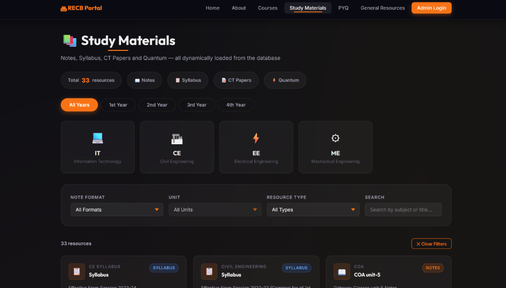
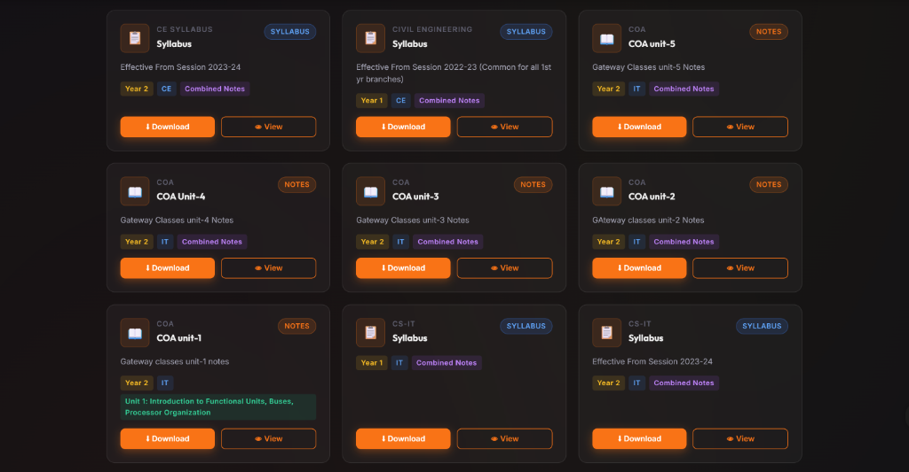
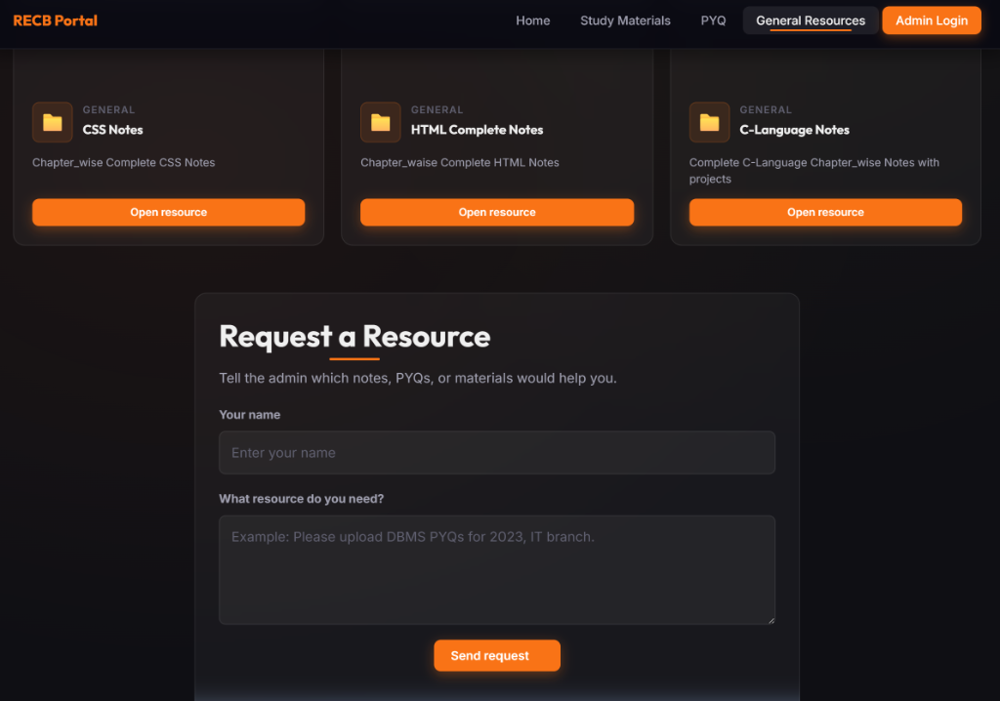
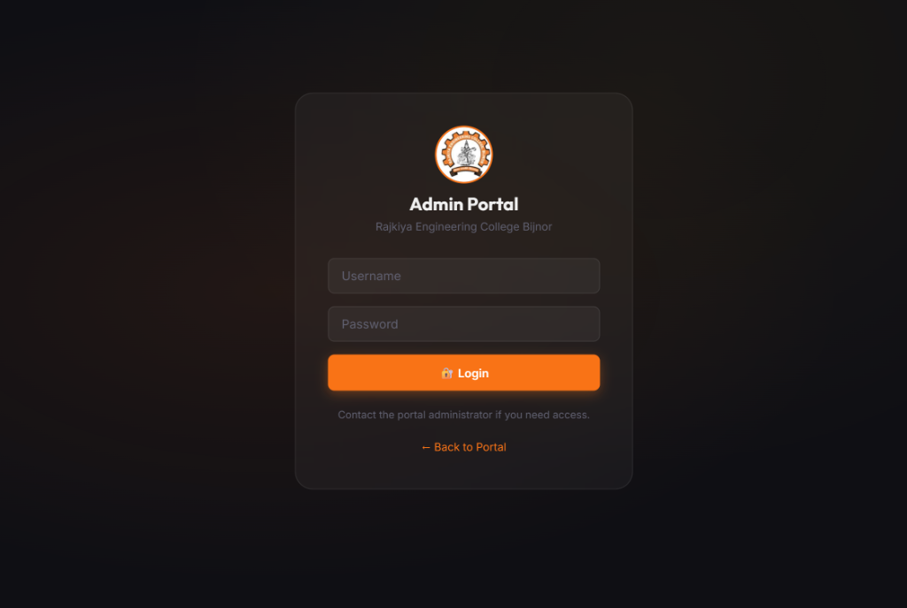
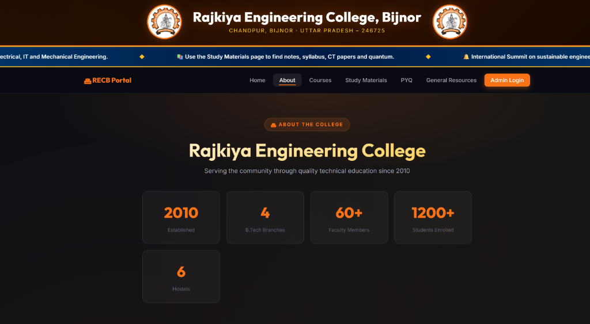

# RECB Academic Hub 🎓

> **REC Bijnor Education Portal** – A modern, full-stack academic resource hub for Rajkiya Engineering College, Bijnor. Students can search, filter, view, and download notes, syllabus, CT papers, and study resources. Authenticated administrators can upload, edit, and manage all academic materials and campus announcements.

[](https://recb-academic-hub-4.onrender.com/)
[](https://nodejs.org/)
[](https://www.mongodb.com/atlas)
[](https://expressjs.com/)

---

## 🌐 Live Web Portal & Links

- **🌐 Public Web Portal**: [https://recb-academic-hub-4.onrender.com/](https://recb-academic-hub-4.onrender.com/)
- **🔐 Admin Dashboard**: [https://recb-academic-hub-4.onrender.com/admin.html](https://recb-academic-hub-4.onrender.com/admin.html)
- **🗄️ API Base URL**: [https://recb-academic-hub-4.onrender.com/api/notes](https://recb-academic-hub-4.onrender.com/api/notes)

---

## ✨ Features

- **📚 Comprehensive Study Resources**: Year-wise (1st, 2nd, 3rd, 4th) and Branch-wise (IT, CE, EE, ME) Notes, Syllabus, CT Papers, Quantums, and PYQs.
- **🔍 Fast Search & Filtering**: Instant search and filtering by branch, year, subject, or resource type.
- **📢 Real-Time Announcements**: Campus noticeboard for important news and announcements.
- **🛡️ Secure Admin Portal**: Password-protected dashboard for managing study materials, uploading files, and updating account credentials.
- **☁️ Cloud & Local Storage**: Supports direct PDF/file uploads as well as external Google Drive resource links.
- **⚡ MongoDB Atlas Data Store**: Automated database seeding and cloud persistence.


---

## 📸 Application Screenshots

### 📚 Study Materials & Branch Filters


### 📄 Notes, Syllabus & CT Paper Cards


### 📂 General Resources & Student Resource Request


### 🔐 Admin Portal Login


### 🏢 About College & Campus Stats


---


## 🚀 Getting Started (Local Setup)

### Prerequisites

- **Node.js**: v20 or v22
- **MongoDB**: Local MongoDB instance or a free [MongoDB Atlas](https://www.mongodb.com/cloud/atlas) URI.

### Installation

1. **Clone the Repository**:
   ```bash
   git clone https://github.com/numanAnsari0301/RECB_Academic-Hub.git
   cd RECB_Academic-Hub
   ```

2. **Install Dependencies**:
   ```bash
   npm install
   ```

3. **Configure Environment Variables**:
   Create a `.env` file in the root directory (or copy `.env.example`):
   ```env
   PORT=3000
   NODE_ENV=development
   SESSION_SECRET=replace-with-a-long-random-secret
   MONGODB_URI=your mongodb url
   ADMIN_USERNAME=portal-admin
   ADMIN_PASSWORD=your-secure-admin-password
   ```

4. **Start the Development Server**:
   ```bash
   npm start
   ```
   Open `http://localhost:3000` in your browser.

---

## ☁️ Deployment on Render

This project includes a pre-configured Render Blueprint ([render.yaml](render.yaml)) for 1-click deployment on [Render](https://render.com).

### Environment Variables required on Render:

| Variable | Description | Example / Default |
| --- | --- | --- |
| `NODE_ENV` | Environment setting | `production` |
| `MONGODB_URI` | MongoDB Atlas Connection URI | `...` |
| `SESSION_SECRET` | Secret key for cookies/sessions | Auto-generated by Render |
| `ADMIN_USERNAME` | Administrator Username | `portal-admin` |
| `ADMIN_PASSWORD` | Administrator Password | `your-secure-admin-password` |

---

## 🔑 Changing Admin Credentials

### Method 1: Via Admin Dashboard
1. Log in at `https://recb-academic-hub-4.onrender.com/admin.html`.
2. Go to **Account Settings**.
3. Enter your current password and your new username & password.

### Method 2: Command Line Reset (Local)
Run the script to reset or create an admin account:
```powershell
$env:ADMIN_USERNAME = "new-admin"
$env:ADMIN_PASSWORD = "new-strong-password"
npm run reset-admin
```

---

## 🛰️ REST API Endpoints

- `GET /api/notes` - Get all materials with optional query filters (`year`, `branch`, `type`, `subject`, `q`)
- `GET /api/announcements` - Get active notices & announcements
- `POST /api/auth/login` - Admin authentication
- `POST /api/auth/logout` - End admin session
- `GET /api/auth/status` - Check current session login status
- `PUT /api/auth/credentials` - Update admin credentials

---


